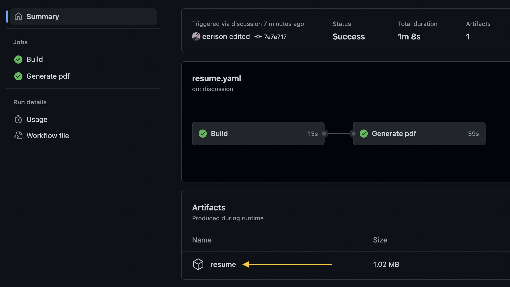

<p align="center">
  
</p>

# Examples
 - [Default](./data/examples/default.pdf)

# Generate your resume

1. Create a [Discussion](https://github.com/shield-wall/myprofile/discussions/categories/resume) into the **Resume** category.
2. Inside the description put the yaml structure saved in [data_example.txt](data/data_example.txt) (you can see the example [here](https://github.com/shield-wall/myprofile/discussions/723) : )
3. when you save your discussion you will see a process running in [Action section](https://github.com/shield-wall/myprofile/actions)
4. After the process finish you will see a resume to download, like this:
5. 
6. Just clink in resume to download the file, and it's done :rocket:
> **Note**
> 
> to update your resume you just need to update the **discussion**, you can put whatever you want, outside yaml scope.

# Run locally
I'm assuming that you have node 18 or higher installed in your machine.

```bash
npm install
npm run node:group:init
npm run dev
npm run node:group:pdf
```

### Preview

you can edit resume data in **data/data.yaml**

Note: you need to generate `json` and `pdf` again

```bash
npm run node:group:pdf
```