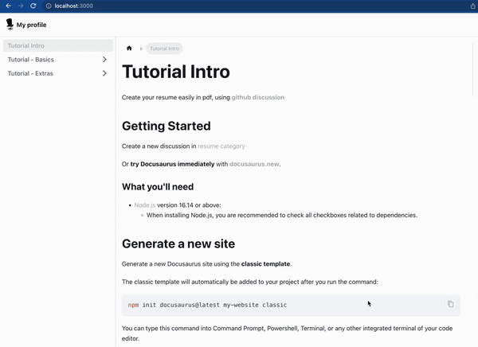
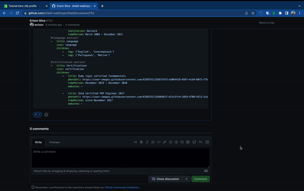
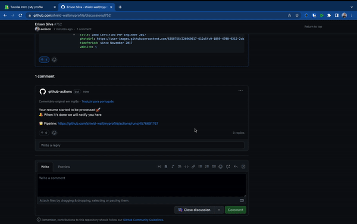

# Tutorial Intro

Create your resume easily in pdf, using **[github discussion](https://github.com/shield-wall/myprofile/discussions/new?category=resume)** 

## Getting Started

Create a new discussion in [resume category](https://github.com/shield-wall/myprofile/discussions/new?category=resume)

### Get your pdf

After you create your resume, scroll down and wait **few secons**, then you will see a comment indicating that your resume started to process.

Wait **~1 minute** and this comment will be updated with a new message contain your resume in pdf.
Now you just need to click on that link and a new tab will open with your pdf, and you can download it.

:::tip Congratulations

Congratulations!!! You have created your first resume on myprofile project 🚀

:::
