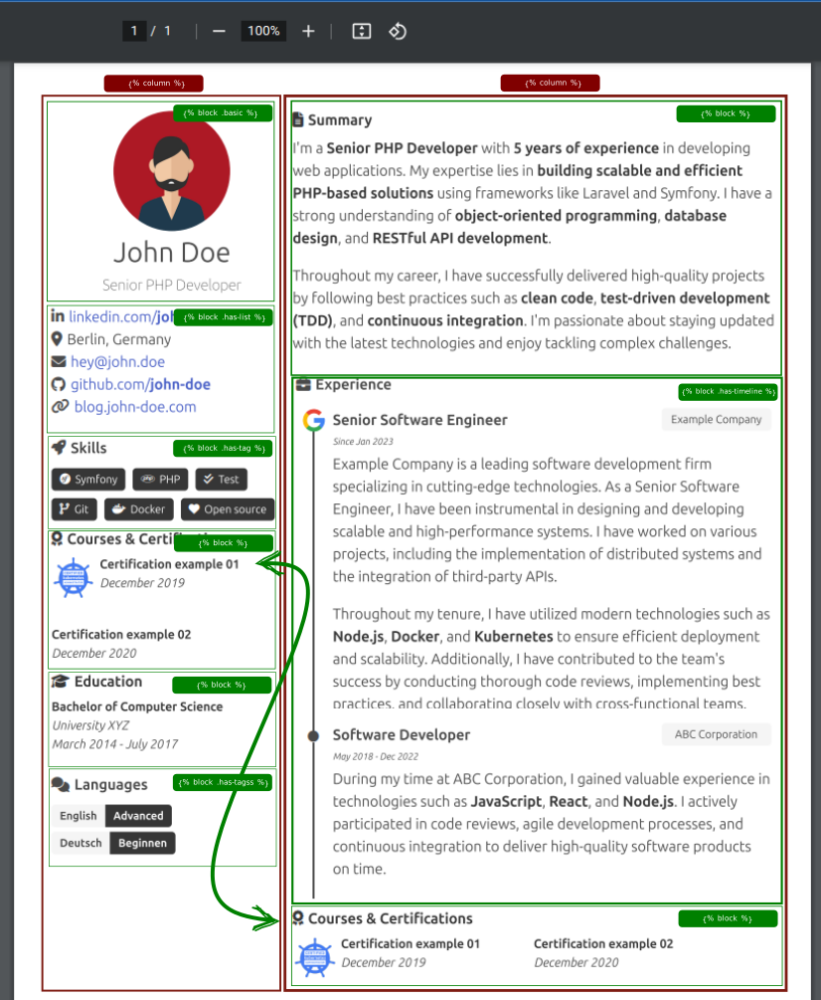

# Overview

Myprofile has the data organized in **columns**, And you can order, remove or duplicate **blocks** into the columns.

:::caution Minium amount of columns.

You most have at last **2 columns** in your resume, otherwise the resume layout could be weird 

:::



#### Colums

In the [resume above 👆](#overview) you can see **two red** squares, Those squares mean **column**, 
and it can contain different **blocks** that can contain: `list`, `tag(s)`, `timeline` or just a simple `block` 

### Resume example

The markdown bellow will generate the pdf above 👆! just create a [new discussion](https://github.com/shield-wall/myprofile/discussions/new?category=resume) and copy and past into the description and wait the pipeline finish.

```markdown



 

# John Doe

## Senior PHP Developer




- [linkedin.com/**john-doe**](https://www.linkedin.com/in/eerison) 
- Berlin, Germany 
- [hey@john.doe](mailto:hey@john-doe.com) 
- [github.com/**john-doe**](https://your-link.com) 
- [blog.john-doe.com](https:blog.erison.work) 




## Skills 

- Symfony 
- PHP 
- Test 
- Git 
- Docker 
- Open source 





## Courses & Certifications 

> 
>> **Certification example 01**
>> *December 2019*

>
>> **Certification example 02**
>> *December 2020*



## Education 

>**Bachelor of Computer Science**
>*University XYZ*
>*March 2014 - July 2017*



## Languages 

**English**
**Advanced**

**Deutsch**
**Beginnen**







## Summary 

I'm a **Senior PHP Developer** with **5 years of experience** in developing web applications. My expertise lies in **building scalable and efficient PHP-based solutions** using frameworks like Laravel and Symfony. I have a strong understanding of **object-oriented programming**, **database design**, and **RESTful API development**.

Throughout my career, I have successfully delivered high-quality projects by following best practices such as **clean code**, **test-driven development (TDD)**, and **continuous integration**. I'm passionate about staying updated with the latest technologies and enjoy tackling complex challenges.




## Experience 

>>> [](https://www.google.com)
>>
>>> ### Senior Software Engineer
>>> #### Example Company
>>> ##### Since Jan 2023
>>
>>> Example Company is a leading software development firm specializing in cutting-edge technologies. As a Senior Software Engineer, I have been instrumental in designing and developing scalable and high-performance systems. I have worked on various projects, including the implementation of distributed systems and the integration of third-party APIs.
>>>
>>> Throughout my tenure, I have utilized modern technologies such as **Node.js**, **Docker**, and **Kubernetes** to ensure efficient deployment and scalability. Additionally, I have contributed to the team's success by conducting thorough code reviews, implementing best practices, and collaborating closely with cross-functional teams.

>>>
>>
>>> ### Software Developer
>>> #### ABC Corporation
>>> ##### May 2018 - Dec 2022
>>
>>> During my time at ABC Corporation, I gained valuable experience in technologies such as **JavaScript**, **React**, and **Node.js**. I actively participated in code reviews, agile development processes, and continuous integration to deliver high-quality software products on time.





## Courses & Certifications 

> 
>> **Certification example 01**
>> *December 2019*

>
>> **Certification example 02**
>> *December 2020*



```

