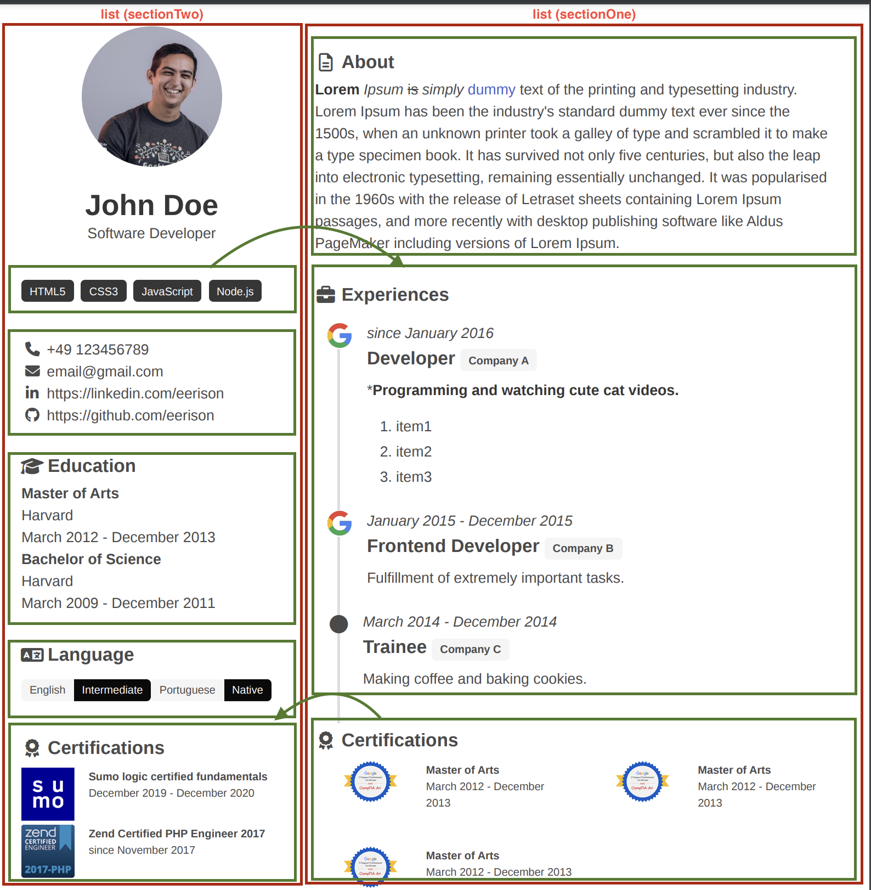
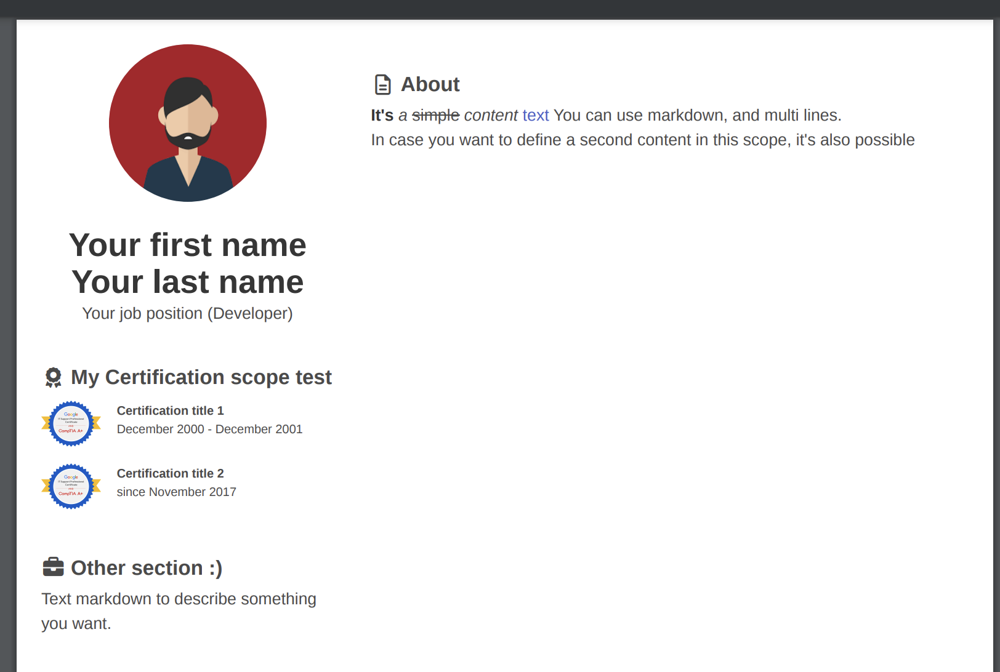

# Sections

Myprofile has the data organized in **sections**, And you can order, remove, duplicate or do whoever you want in two main
**sections group** `sectionOne` and `sectionTwo`.



#### Section groups

In the [resume above 👆](#sections) you can see **2 red** squares, Those squares mean **sections group**, 
and it can contain different sections/scope that can contain: `experience`, `certification`, `education`, `tags` 
and so on ([Here](/structure/section-chieldren-types) you can check what sections' children types are available).

:::tip Move section

You can move section/scope between sections group (`sectionOne`, `sectionTwo`), It means that you can have certification on the right side, or left side.

:::

:::info Remove section

In case you don't want some section/scope in the default template, you can just remove that.

:::

### Dive into sections group, scope and children

Here you can see the minimum structure to use in your resume.

I will create a `content section/scope` and an `certification section/scope`

```yaml
    basic:
        firstName: Your first name
        lastName: Your last name
        # Your profile image
        photoUrl: https://user-images.githubusercontent.com/6358755/229285256-03f05195-33b1-477f-ac5a-155a6a26a8c5.png
        position: Your job position (Developer)

    #Section group one.
    sectionOne:
        
        ### here starts about section/scope.
        -   title: About # It's the Section title, and it will appear above of children section.
            icon: fileDescription #It's the icon that will appear on the left side of title
            children: #Sections' children are SimpleContent, Experience, Education etc...
                -   content: |
                        **It's** *a* ~simple~ _content_ [text](https://www.google.com)
                        You can use markdown, and multi lines.

                -   content: In case you want to define a second content in this scope, it's also possible        
        ### here end about section.

    #Section group one.
    sectionTwo:

        ### here starts certification section/scope.
        -   title: My Certification scope test
            icon: certification
            children: #Sections' children are SimpleContent, Experience, Education etc...
                -   title: Certification title 1
                    photoUrl: https://user-images.githubusercontent.com/6358755/229285409-0b815f19-6a33-4dce-b5be-dbbf4b5d05a5.jpg
                    timePeriod: December 2000 - December 2001
                    website: https://www.google.com #it's optional.

                -   title: Certification title 2
                    photoUrl: https://user-images.githubusercontent.com/6358755/229285409-0b815f19-6a33-4dce-b5be-dbbf4b5d05a5.jpg
                    timePeriod: since November 2017
                    website: ~
        ### here end certification section.

        ### here starts other section/scope.
        -   title: Other section :)
            icon: work
            children: 
                -   content: |
                        Text markdown
                        to describe something you want.
        ### here end other section/scope.
```

If I copy and past the code above a put inside ```yaml ```` tags, in [discussion](https://github.com/shield-wall/myprofile/discussions).

It will result in a pdf like this



:::caution Resume url

It's really important to put your **yaml** content inside **```yaml ````** tags

\```yaml
    
    >>> Put your content HERE <<<<<
    
\```

:::

