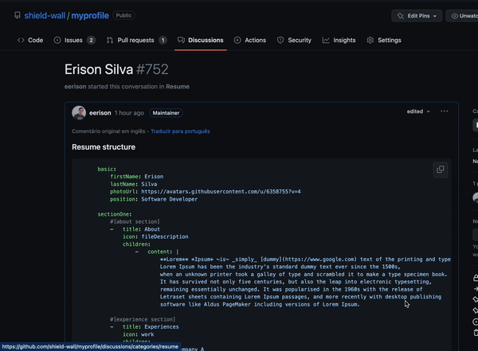

# Update your resume

After you have **[created your resume](/)**, you probably want to update it, don't you 😄?

To have this done in **myprofile**, you just need to change something in your discussion's description.

like add a `space`, `dot`, `blank line` or whatever you want.

After you click on `Update discussion`, you just need to wait few minutes until your resume be processed again.

:::info INFO

You can check [here](/#get-your-pdf) to know more about this process time.

:::
