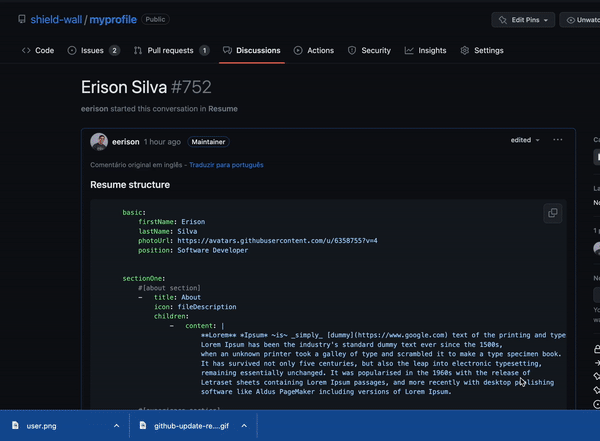

# Upload images

There are few fields in your resume that you can add images, and whole of them uses **image url**, 
you can use external links, But we **highly** recommend you to use GitHub uploads.

### Github upload

On the every textarea footer field in GitHub, you can see this `Attach files by dragging & dropping, selecting or pasting them.`,
Clicking on that label you can select images in your computer, and upload them. Or you can also dragdrop some image to that textarea.

In this example we are going to use comments sections to upload images.

:::info INFO

You don't need to save the images in your comments if you don't want, After you get the **image's url**, you can just cancel the comment.

:::
